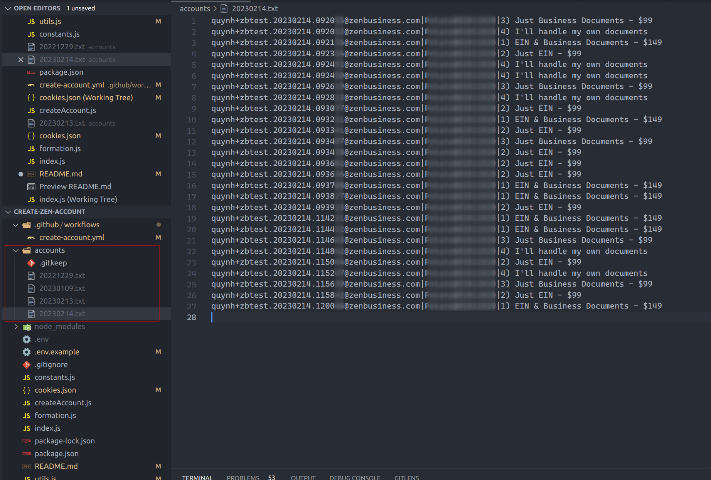

# Create Zen Accounts

## Steps are below

1. Install Node 16.x
  
2. create .env file

```
NAME=tung
PASSWORD=Example@123
```

3. Install dependencies

```
npm install
```

3. Run script to create accounts
  
Example run create 20 accounts
```
npm run start 20
```

4. New accounts are in accounts folder


